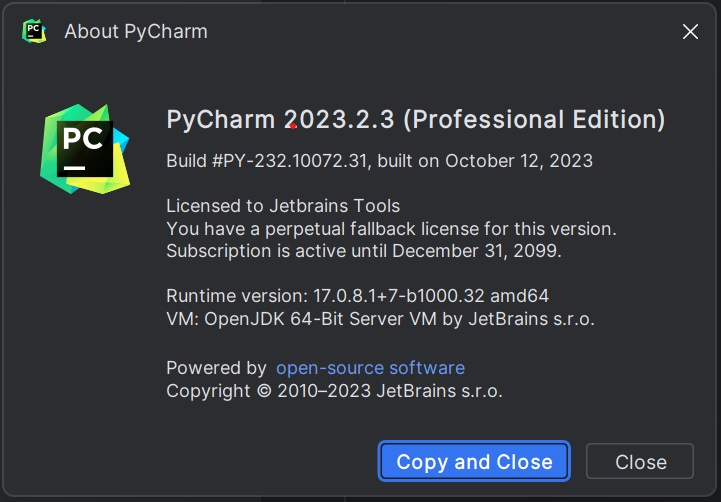
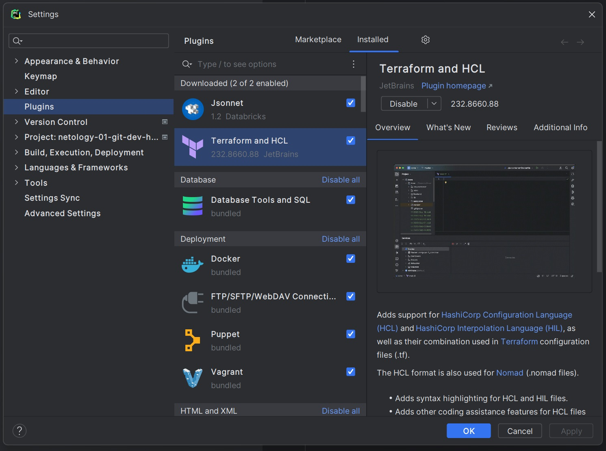
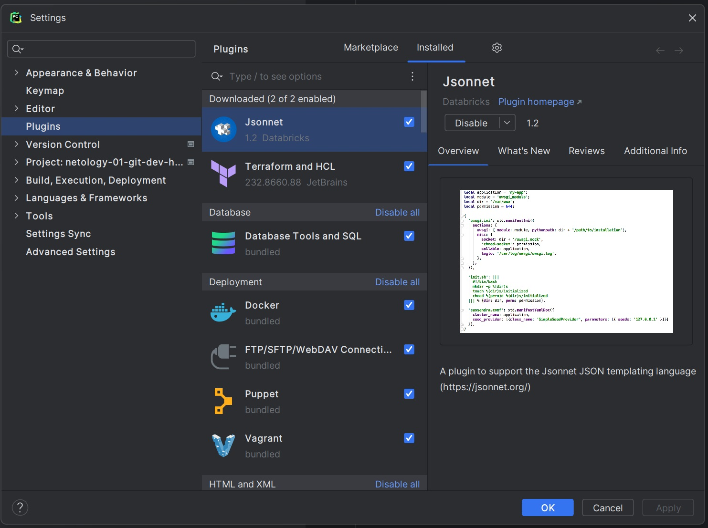
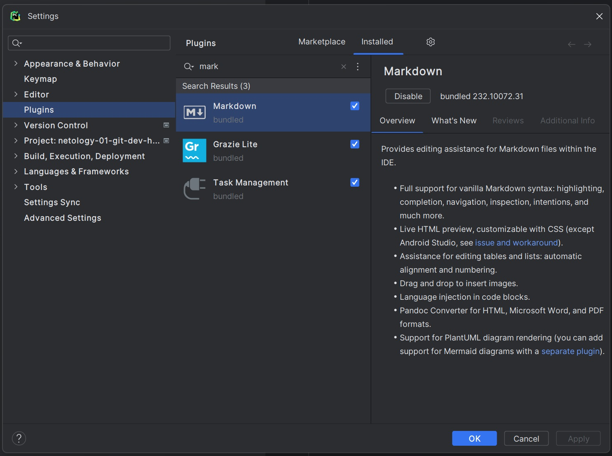
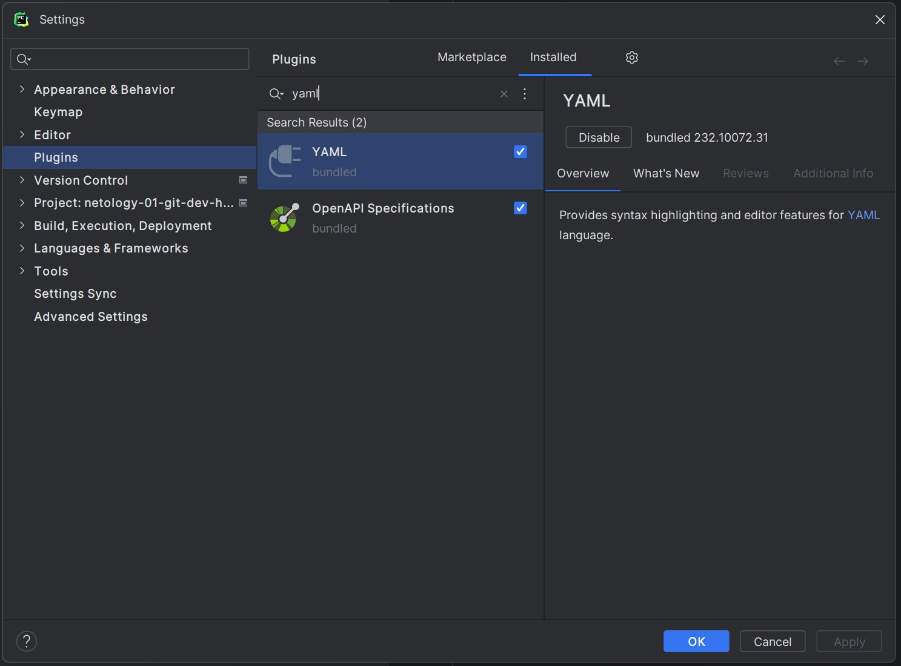
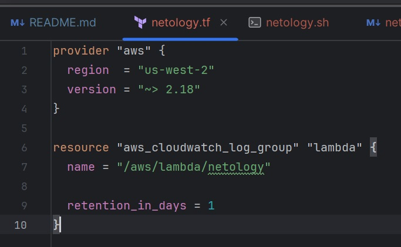
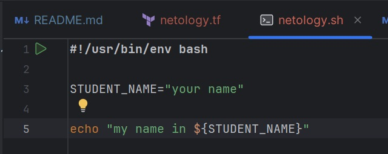
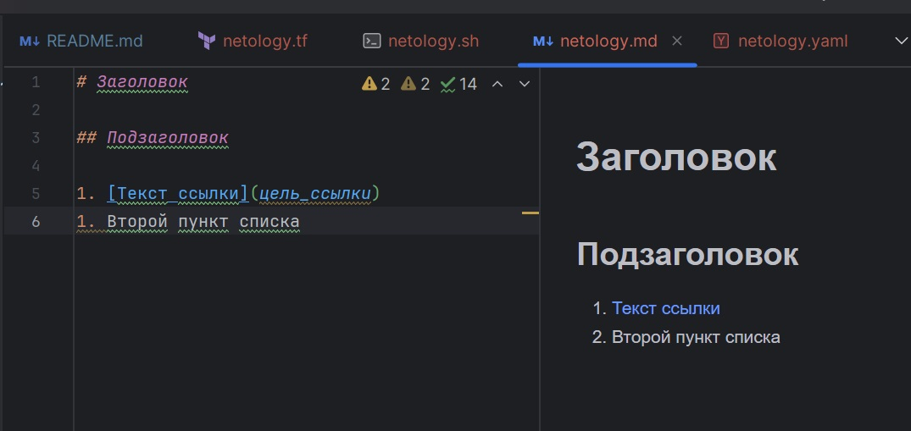
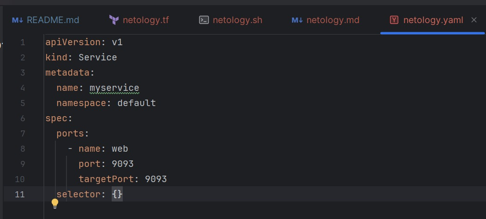
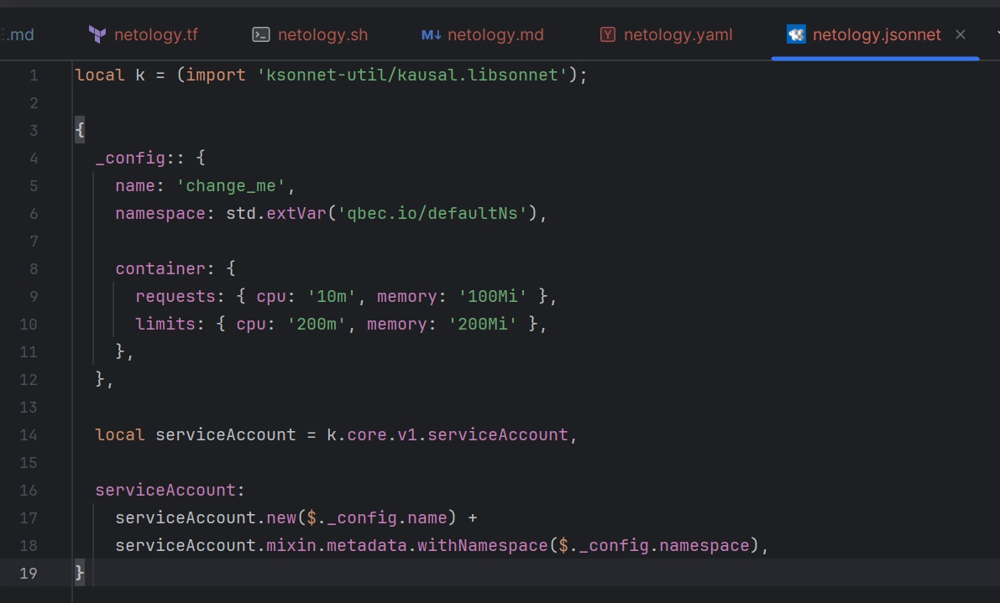

# Домашнее задание к занятию «Роль DevOps-инженера в разработке программного обеспечения»

## Задание 1. Подготовка рабочей среды

*Ход выполнения задания:*

1. Установлен PyCharm.  

2. Установлены плагины:
Terraform  

Jsonnet  

*Плагины MarkDown и Yaml установлены автоматически при установке PyCharm*  
MarkDown  

Yaml  

3. Созданы файлы для проверки плагинов:
* [netology.tf](netology.tf) — Terraform;
* [netology.sh](netology.sh) — Bash;
* [netology.md](netology.md) — Markdown; 
* [netology.yaml](netology.yaml) — YAML;
* [netology.jsonnet](netology.jsonnet) — Jsonnet.

4. Убедился, что подсветка синтаксиса работает. Файлы выглядят следующим образом:
* Terraform:  
  
* Bash:  
  
* Markdown:  
  
* Yaml:  
  
* Jsonnet:  
  

----

## Задание 2. Описание жизненного цикла задачи (разработки нового функционала)

__Описание задачи:__    
*Представьте, что вы работаете в стартапе, который запустил интернет-магазин. Он достаточно успешно развивался, и пришло время налаживать процессы: у вас стало больше конечных клиентов, менеджеров и разработчиков.*

*Сейчас от клиентов вам приходят задачи, связанные с разработкой нового функционала. Задач много, и все они требуют выкладки на тестовые среды, одобрения тестировщика, проверки менеджером перед показом клиенту. В некоторых случаях вам будет необходим откат изменений.* 

__Цель:__    
*Обеспечить жизненный цикл разработки нового функционала*

__Описание решения:__    
1. Этап "Планирование"  
Осуществляется формирование технических и бизнес-требований к новому функционалу.  
_Задействованные участники команды:_ менеджер, разработчики, инженер DevOps (при необходимости).

2. Этап "Разработка"  
Выполняется написание кода нового функционала.  
_Задействованные участники команды:_ разработчики.

3. Этап "Сборка"  
Выполняется сборка кода в тестовой среде. Сборка прошла успешно - переходим к следующему этапу. Сборка прошла неуспешно - осуществляется возврат к предыдущему пункту и выполняется доработка кода.    
_Задействованные участники команды:_ разработчики, инженер DevOps.

4. Этап "Тестирование"  
Выполняется тестирование нового кода. В зависимости от объема и вида доработок применяются: unit-тестирование, интеграционное тестирование, функциональное тестирование или E2E-тесты.    
Тесты прошли успешно - переходим к следующему этапу. Тесты завершились неудачно - возврат кода на доработку.    
_Задействованные участники команды:_ менеджер, тестировщики, инженер DevOps.

5. Этап "Выпуск релиза"  
Менеджер принимает решение о выпуске релиза. Положительное - выпускаем релиз и переходим к следующему этапу. Отрицательное - ожидаем новых доработок кода от разработчиков.  
_Задействованные участники команды:_ менеджер, инженер DevOps.

6. Этап "Развертывание"  
Выполняется развертывание нового функционала в продуктивной среде. Развертывание обязательно включает в себя создание резервной копии на момент обновления.  
_Задействованные участники команды:_ инженер DevOps.

7. Этап "Эксплуатация"  
Ввод в эксплуатацию нового функционала.  
_Задействованные участники команды:_ инженер DevOps.

8. Этап "Мониторинг"  
Мониторинг и наблюдение за инфраструктурой продуктовой среды и работой нового функционала.  
В случае выявления ошибок/аномалий/неполадок в работе по согласованию с менеджером выполняется откат на предыдущую версию.  
Все работает в штатном режиме - ожидаем нового релиза.  
_Задействованные участники команды:_ инженер DevOps.
